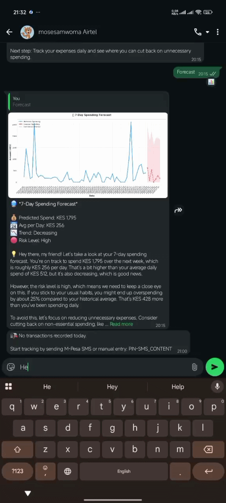
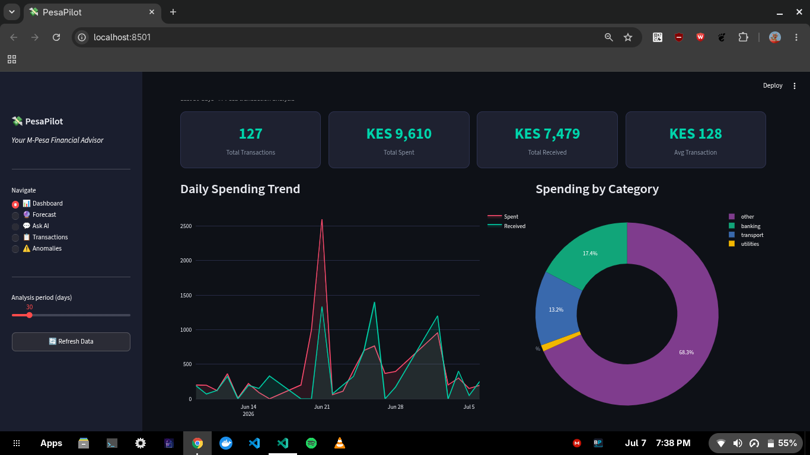
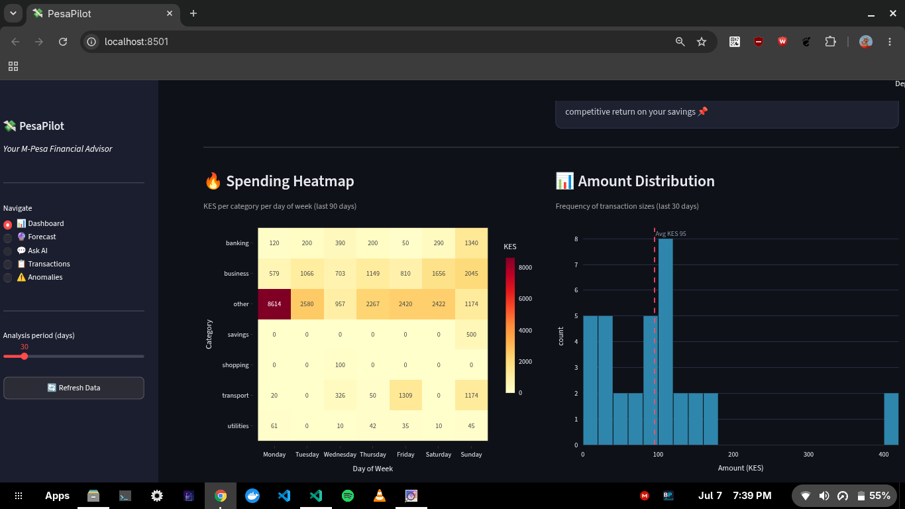
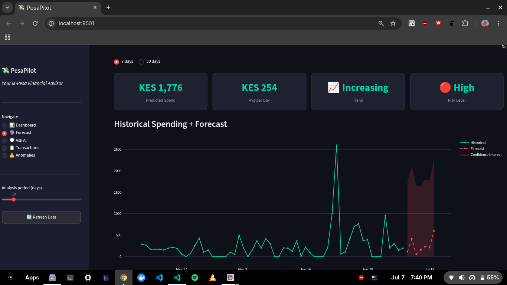
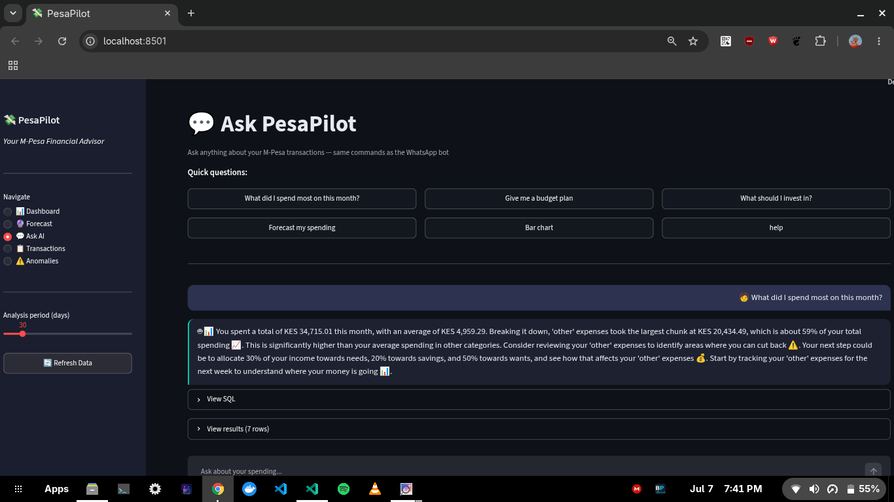

# PesaPilot

AI-powered M-Pesa financial assistant for Kenya. Parses your SMS transaction backup, stores it in Supabase, and lets you explore your spending — and get real Kenyan financial advice — through a Streamlit dashboard or by texting it on WhatsApp.



---

## Features

- **Dashboard** — spending overview, daily trend, category breakdown, top merchants, heatmap, histogram, and AI-generated insights

  
  

- **Forecast** — Prophet-powered 7-day and 30-day spending projections with confidence band, trend classification (Increasing / Decreasing / Stable), risk level (Low / Moderate / High), and a Groq plain-English summary
- **Ask AI** — ask questions in plain English; Groq turns them into SQL, runs it, and explains the result grounded in your actual numbers
- **Budget plans** — ask for a "budget plan" and get a KES-denominated needs/wants/savings split sized to your real spending
- **Investment guidance** — ask "what should I invest in?" and get a Sacco / MMF / T-Bill recommendation sized to your actual free cash flow
- **Transactions** — filterable, searchable transaction history
- **Anomalies** — unusually large transactions flagged by z-score
- **WhatsApp Bot** — ask the same questions, get charts, get budget/investment advice, and log SMS manually, all from WhatsApp
- **Daily summary** — a 9 PM scheduled job (Africa/Nairobi) sends an end-of-day spending digest to your WhatsApp
- **Two-tier AI** — fast model (`llama-3.1-8b-instant`) for chat/insights, smarter model (`llama-3.3-70b-versatile`) for SQL generation, result analysis, and budget/investment advice
- **SQL safety guard** — every LLM-generated SQL query is validated (`SELECT`-only, no stacked statements, no DDL/DML keywords) before it touches the database
- **Response caching** — in-memory TTL cache on all Groq calls, automatically invalidated whenever new transactions are inserted

> **Note:** loading SMS data has no CLI command or dashboard button in the current codebase — see [Load your data](#5-load-your-data) below for the one-off script that does it.

---

## WhatsApp Bot — Two Modes

PesaPilot ships with **two WhatsApp bot implementations**. They share the same FastAPI backend and Supabase database — only the WhatsApp connection layer differs.

| | `whatsapp_bot.js` | `whatsapp_bot.ts` |
|---|---|---|
| **Library** | whatsapp-web.js | Baileys |
| **Connection** | Headless Chromium (Puppeteer) | Pure WebSocket |
| **Use case** | Local development | Docker / VPS (production) |
| **Memory** | ~300–500 MB (Chromium) | ~80–120 MB |
| **Auth session** | `.wwebjs_auth/` | `.baileys_auth/` |
| **npm script** | `npm run dev:wwebjs` | `npm run dev` |
| **Docker** | ❌ not used | ✅ default |

> **Rule of thumb:** use `whatsapp_bot.js` when developing locally on your own machine. Use `whatsapp_bot.ts` (Baileys) for everything deployed — Docker, VPS, Railway, Raspberry Pi, any server. Baileys' low memory footprint (~80–120 MB, no Chromium) makes it well-suited to a Raspberry Pi (3B+ or newer recommended) running the Dockerized setup, giving you an always-on bot without paying for a VPS.

---

## Prerequisites

- Python 3.10+
- Node.js 20+ (`package.json` requires `>=20.0.0`)
- A [Supabase](https://supabase.com) project (free tier works)
- A [Groq](https://console.groq.com) API key (free tier works)
- Docker + Docker Compose for VPS/production deployment
- A spare WhatsApp-capable SIM to run the bot on (you message it from your main number)

---

## 1. Clone and install

```bash
git clone https://github.com/mosesamwoma/PesaPilot.git
cd PesaPilot

# Python
python -m venv venv
source venv/bin/activate        # Windows: venv\Scripts\activate
pip install -r requirements.txt

# Node.js
npm install
```

---

## 2. Configure environment variables

```bash
cp .env.example .env
```

Open `.env` and fill in the values. **Never commit `.env`** — it is already in `.gitignore`.

### Required

| Variable | Where to get it |
|---|---|
| `SUPABASE_URL` | supabase.com → Settings → API |
| `SUPABASE_KEY` | supabase.com → Settings → API |
| `GROQ_API_KEY` | console.groq.com → API Keys |
| `WHATSAPP_MAIN_NUMBER` | Your main number e.g. `254712345678` (country code, no `+`) — the number you text the bot **from** |
| `WHATSAPP_PIN` | Any 4-digit number you choose e.g. `1234` — used for manual SMS entry |

### Optional

| Variable | Default | Purpose |
|---|---|---|
| `WHATSAPP_LID` | — | WhatsApp sometimes routes your number through an internal LID. Run the bot once, send a message, copy the value printed next to `From:` in the terminal, paste it here |
| `API_URL` | `http://127.0.0.1:8000` | Where the bot looks for the FastAPI service |
| `WHATSAPP_API_PORT` | `8000` | Port FastAPI listens on |
| `LLM_MODEL_FAST` | `llama-3.1-8b-instant` | Groq model used for chat and dashboard insights (speed-sensitive) |
| `LLM_MODEL_SMART` | `llama-3.3-70b-versatile` | Groq model used for SQL generation, result analysis, budget/investment advice (accuracy-sensitive) |
| `LLM_MODEL` | — | Legacy/back-compat: if set, overrides `LLM_MODEL_FAST` |
| `LLM_TEMPERATURE` | `0.6` | Groq sampling temperature |
| `LLM_MAX_TOKENS` | `600` | Max tokens per Groq response |
| `NODE_ENV` | `production` | Node runtime mode |
| `NODE_OPTIONS` | `--max-old-space-size=2048` | Node heap size cap |
| `TZ` | `Africa/Nairobi` | Timezone — affects log timestamps and the 9 PM daily-summary cron |
| `WHATSAPP_USE_PAIRING_CODE` | `false` | Use a pairing code instead of a QR code to link the Baileys bot |
| `BAILEYS_AUTH_PATH` | `./.baileys_auth` | Where Baileys session files are written |
| `BAILEYS_LOG_LEVEL` | `info` | Baileys/pino log verbosity |
| `WWEBJS_AUTH_PATH` | `./.wwebjs_auth` | Where whatsapp-web.js session files are written |

> `.env.example` also lists `APP_ENV`, `DEBUG`, `SECRET_KEY`, `LOG_LEVEL`, `DB_MAX_CONNECTIONS`, `DB_CONNECTION_TIMEOUT`, `DB_QUERY_LIMIT`, `BATCH_SIZE`, `CACHE_TTL`, and `API_TIMEOUT`. None of these are currently read anywhere in the codebase — they're placeholders for future use and safe to ignore.

---

## 3. Create the database schema

1. Go to [supabase.com/dashboard](https://supabase.com/dashboard) → your project → **SQL Editor → New Query**
2. Paste the contents of `schema/init_db.sql`
3. Click **Run**

You should see: `PesaPilot DB ready ✅`

This creates the `transactions` table, indexes, a `run_query(text)` RPC function (only `SELECT` is ever allowed through it), and two read-only views (`daily_summary`, `category_summary`).

---

## 4. Get your M-Pesa data

1. Install [SMS Backup & Restore](https://play.google.com/store/apps/details?id=com.riteshsahu.SMSBackupRestore) on the phone with your M-Pesa SMS history
2. **Back Up** → select **SMS only** → save to phone storage or Google Drive
3. Transfer the XML file to your computer
4. Place it in `data/raw/`

---

## 5. Load your data

There is **no CLI command and no dashboard button** for bulk-loading an SMS backup — `run.py` only starts services (see [Run locally](#6-run-locally)), and the dashboard has no "Load Data" page. The parsing/loading logic still exists in `MpesaAnalyzer.load_transactions()`, so load your backup with a one-off script:

```bash
python -c "
from src.analyzer import MpesaAnalyzer
count = MpesaAnalyzer().load_transactions('data/raw/your-sms-backup.xml')
print(f'Loaded {count} transactions')
"
```

Re-running on the same or updated file is safe — transactions are upserted on `transaction_id`, so duplicates are silently skipped.

Once transactions exist in Supabase, the only way to add more afterward is one at a time, via the WhatsApp bot's manual SMS entry (`PIN-PASTE_SMS_HERE`) or the `/parse-sms` API endpoint — both call `MpesaAnalyzer.parse_and_insert_sms()`, the single-message counterpart to the bulk loader above.

---

## 6. Run locally

### Both services together

```bash
python run.py
```

Starts the FastAPI backend (port 8000) and the Streamlit dashboard (port 8501) together, and shuts both down cleanly on Ctrl+C. This does **not** start the WhatsApp bot — that's always a separate process (see below).

### Dashboard only

```bash
streamlit run dashboard/app.py
```

Open [http://localhost:8501](http://localhost:8501).

### API + WhatsApp bot (whatsapp-web.js — local dev)

Open two terminals:

```bash
# Terminal 1 — FastAPI backend
npm run api
# (equivalent to: uvicorn whatsapp.whatsapp_api:app --host 0.0.0.0 --port 8000 --reload)

# Terminal 2 — WhatsApp bot (whatsapp-web.js + Chromium)
npm run dev:wwebjs
```

A QR code prints in Terminal 2 on first run. Scan it: **WhatsApp → Settings → Linked Devices → Link a Device**.

Session is saved under `.wwebjs_auth/` — no rescan on normal restarts.

### API + WhatsApp bot (Baileys TypeScript — also works locally)

```bash
# Terminal 1 — FastAPI backend
npm run api

# Terminal 2 — WhatsApp bot (Baileys, no Chromium)
npm run dev
```

Session is saved under `.baileys_auth/`.

> The Streamlit dashboard is for local use only and is not included in the Docker image.

---

## npm scripts

```bash
npm run api          # FastAPI backend with auto-reload (uvicorn --reload)
npm run dev           # Baileys bot via ts-node (auto-restart on save)
npm run dev:wwebjs    # whatsapp-web.js bot via nodemon
npm run build         # Compile whatsapp_bot.ts → dist/whatsapp_bot.js
npm start             # Run compiled Baileys bot: node dist/whatsapp_bot.js
npm run start:wwebjs  # Run whatsapp-web.js bot: node whatsapp/whatsapp_bot.js
npm run clean         # Remove dist/ and auth session folders
```

---

## CLI reference

`run.py` takes no subcommands — it starts both the FastAPI backend and the Streamlit dashboard and blocks until you Ctrl+C:

```bash
python run.py
```

There is no `setup`, `load`, `ask`, or `dashboard` subcommand. For loading data see [Load your data](#5-load-your-data) above; for a connection check, `python -c "from src.database import SupabaseDB; SupabaseDB()"` will raise if `SUPABASE_URL`/`SUPABASE_KEY` are missing or wrong.

---

## The Forecast page

Uses [Meta Prophet](https://facebook.github.io/prophet/) to project daily spending forward 7 or 30 days.



**Minimum data required:** 14 days of spending history.

**How it works:**
1. Pulls up to 180 days of debit transactions from Supabase
2. Aggregates into a daily series (zero-filled for no-spend days)
3. Prophet fits a linear-growth model with weekly seasonality
4. Result is cached in memory (6-hour TTL, invalidated on new inserts)
5. Groq writes a plain-English insight framing the projection as a prediction, not a fact

**Trend classification:** Increasing / Decreasing / Stable based on ±7% difference between first and second half of the forecast horizon.

**Risk level:** High (>25% above historical pace or volatility >0.9) / Moderate (10–25% or 0.6–0.9) / Low (everything else).

---

## What you can ask the bot



| You send | What happens |
|---|---|
| `bar chart` / `pie chart` / `trend` / `heatmap` / `merchants` / `histogram` | Chart rendered and sent as an image |
| `What did I spend on food?` | Plain-English answer with KES + % breakdown |
| `Give me a budget plan` | Needs/wants/savings split in KES, one category to trim |
| `What should I invest in?` | Sacco / MMF / T-Bill recommendation sized to your surplus |
| `forecast` / `forecast 30 days` | Spending forecast with trend, risk level, and AI summary |
| `Summary` / `Daily summary` / `Today` | Period or daily financial digest |
| `help` | Full command list |
| `1234-MJ7XK2P9 Confirmed. You have sent...` | Manual SMS: `PIN-PASTE_SMS_HERE` |

Anyone texting the bot's WhatsApp number who isn't `WHATSAPP_MAIN_NUMBER` / `WHATSAPP_LID` is simply left alone — the bot does not reply or react, so the message sits as a normal WhatsApp chat for you to answer manually from your phone. Only messages from `WHATSAPP_MAIN_NUMBER` (or `WHATSAPP_LID`) trigger the bot's AI/analytics replies.

---

## Docker (VPS / Production)

> **The Docker image uses Baileys (`whatsapp_bot.ts`) exclusively.**
> Baileys connects to WhatsApp over a pure WebSocket — no Chromium, no Puppeteer, no browser needed. This is why the Docker image is lean (~80 MB Node footprint vs ~500 MB with Chromium).
>
> `whatsapp_bot.js` (whatsapp-web.js) is available for local development only and is never invoked inside the container.

The container runs **both the FastAPI backend and the Baileys bot together** — no separate bot host needed.

### Build and run

```bash
docker compose up -d --build
docker compose logs -f pesapilot     # watch startup + QR code
```

- Health check: `http://YOUR_VPS_IP:8000/health`

### What's persisted

`docker-compose.yml` uses bind mounts, not named volumes:

| Host path | Container path | Purpose |
|---|---|---|
| `./sessions` | `/app/.baileys_auth` | Baileys session — survives restarts, no rescan needed |
| `./data` | `/app/data` | Raw/processed transaction files |

Back them up:

```bash
tar czf pesapilot-backup-$(date +%F).tar.gz ./sessions ./data
```

### Management

```bash
docker compose ps                        # status
docker compose logs -f pesapilot         # live logs
docker compose restart pesapilot         # restart (session persists)
docker compose down                      # stop and remove container
docker compose up -d --build             # rebuild after code change

# Force a new QR scan (wipes Baileys session)
docker compose exec pesapilot rm -rf /app/.baileys_auth
docker compose restart pesapilot
docker compose logs -f pesapilot
```

### Test the API

```bash
curl http://YOUR_VPS_IP:8000/health

curl -X POST http://YOUR_VPS_IP:8000/ask \
  -H "Content-Type: application/json" \
  -d '{"question": "What did I spend on food?"}'

curl -X POST http://YOUR_VPS_IP:8000/ask \
  -H "Content-Type: application/json" \
  -d '{"question": "Give me a budget plan"}'
```

---

## Redeploying after a code change

`redeploy.sh` (in the project root) syncs your local changes to the VPS and rebuilds/restarts the Docker container in one step. It doesn't hardcode any server details — you're prompted for them each run, so the script is safe to keep in a public/open-source repo.

### One-time setup

```bash
chmod +x redeploy.sh
```

### Usage

```bash
./redeploy.sh
```

You'll be prompted for:

- VPS username: `your-username`
- VPS host/IP: `your.vps.ip.address`
- Remote project path: press Enter to accept the default path (`~/PesaPilot`)

Then for your SSH password (may be asked more than once, since sync, rebuild, and status checks each open a separate SSH connection).

The script then:
1. **Syncs** your local project to the VPS via `rsync` (skipping `node_modules`, `venv`, `dist`, `.git`, `sessions`, `.baileys_auth`, `whatsapp-sessions`, logs, and caches)
2. **Rebuilds** the Docker image on the VPS (`docker compose up -d --build`), which recompiles the TypeScript bot and restarts the container
3. **Shows** the container status so you can confirm it came up healthy

### Flags

```bash
./redeploy.sh --no-build   # sync only, then restart without rebuilding (fast path for non-code changes)
./redeploy.sh --logs       # after deploying, tail the container logs so you can watch it come online
```

---

## How the AI advice is grounded

Every question sent to Groq is paired with live context pulled from Supabase first:

- Summary stats (total spent, received, balance, transaction count)
- Top spending categories with KES amounts and percentages
- Top merchants/recipients
- Recent daily spending trend
- Detected anomalies

This sits under a Kenya-specific system prompt (`src/groq_client.py`) that enforces: show amounts and percentages, compare to averages, give one actionable tip, reference real Kenyan options (Sacco, MMF, Treasury Bills), recommend a budget split, nudge toward an emergency fund, celebrate small wins. It never recommends Fuliza or names a specific bank.

**Two-tier model routing:**

| Model | Used for |
|---|---|
| `LLM_MODEL_FAST` (`llama-3.1-8b-instant`) | `chat()`, `generate_insights()`, `generate_forecast_insights()` |
| `LLM_MODEL_SMART` (`llama-3.3-70b-versatile`) | `generate_sql()`, `analyze_results()`, `budget_plan()`, `investment_advice()` |

**SQL safety guard:** all LLM-generated SQL is passed through `is_safe_select_sql()` before execution — it must start with `SELECT`, contain no stacked statements (`;`), and contain none of `DROP / DELETE / UPDATE / INSERT / ALTER / TRUNCATE / GRANT / REVOKE / EXEC / EXECUTE / CREATE / ATTACH / REPLACE / MERGE / CALL`. Anything that fails is rejected and never reaches Supabase.

**Response caching:** every Groq call is cached in-memory, keyed on a SHA-256 hash of (system prompt, user prompt), with TTLs tuned per call type — 1 hour for SQL generation, 15 min for budget/investment advice, 10 min for insights, 5 min for general chat. The cache is cleared automatically whenever a new transaction is inserted (`GroqClient.invalidate_cache()`).

---

## Testing

```bash
python -m pytest tests/ -v
```

53 tests across `test_parser.py` (17), `test_analyzer.py` (10), `test_database.py` (11), `test_forecasting.py` (15).

> `test_analyzer.py` and `test_database.py` are **not mocked** — they call your real Supabase project and Groq API key. `test_insert_and_retrieve` writes one row (`transaction_id = TEST0000001`) into your live `transactions` table. Don't run against a production database you care about being pristine.
>
> `test_parser.py` and `test_forecasting.py` are fully self-contained (synthetic data, no network calls) and safe to run anywhere.

---

## Troubleshooting

| Issue | Fix |
|---|---|
| `❌ .env file not found!` (from `python run.py`) | Copy `.env.example` to `.env` in the project root before running |
| `run_query not found` / RPC errors | Run `schema/init_db.sql` in the Supabase SQL Editor |
| `ModuleNotFoundError: No module named 'src'` | Run commands from the project root, not from inside `src/` or `whatsapp/` |
| No transactions after loading XML | Confirm the file is an unmodified export from SMS Backup & Restore containing M-Pesa messages |
| Port 8000 already in use | Set `WHATSAPP_API_PORT` to another port and update `API_URL` and `docker-compose.yml` to match |
| **Baileys:** `405 Connection Failure` loop, no QR shown | The bot auto-fetches the latest WA Web protocol version on startup — if it still loops, wipe `.baileys_auth/` and restart |
| **Baileys:** QR never appears after wiping session | Check internet connectivity from the container: `docker compose exec pesapilot curl -I https://web.whatsapp.com` |
| **whatsapp-web.js:** `Failed to launch the browser process` | Chromium is missing or `PUPPETEER_EXECUTABLE_PATH` is wrong — only relevant for local dev, not Docker |
| **whatsapp-web.js:** `profile already in use` after a crash | Delete `.wwebjs_auth/` once, restart, and rescan the QR |
| WhatsApp session keeps logging out | Confirm the auth path (`./sessions` for Docker, `.baileys_auth/` locally) is not being wiped by your deploy process |
| Charts not sending | Confirm `matplotlib` and `seaborn` are installed: `pip install matplotlib seaborn` |
| Forecast shows "Not enough data" | You need at least 14 distinct days of debit transactions |
| Forecast shows "forecasting engine unavailable" | `pip install prophet cmdstanpy` |
| Groq rate limit / empty AI responses | Wait ~60s and retry; lower `LLM_MAX_TOKENS` if it happens often |
| `streamlit: command not found` | Activate your virtualenv: `source venv/bin/activate` |
| `balance` column empty for some rows | Expected — not every M-Pesa SMS includes a balance figure |
| `pytest` fails on Supabase/Groq tests | Tests need real credentials and the schema from `schema/init_db.sql` already applied |

---

## Future Improvements

- Multi-user support — currently hardcoded to one number/Supabase project
- Bring back a data-loading entry point — `MpesaAnalyzer.load_transactions()` still works but has no CLI or dashboard UI in front of it
- Other mobile money providers — Airtel Money, T-Kash via pluggable parsers
- Smarter anomaly detection — ML-based per-user patterns instead of z-score
- Budget goals with alerts — proactive WhatsApp pings near/over budget
- Self-hosted/local LLM option — for privacy-conscious users
- CI/CD pipeline — automated tests + Docker builds via GitHub Actions
- Native mobile app — replaces local Streamlit dashboard