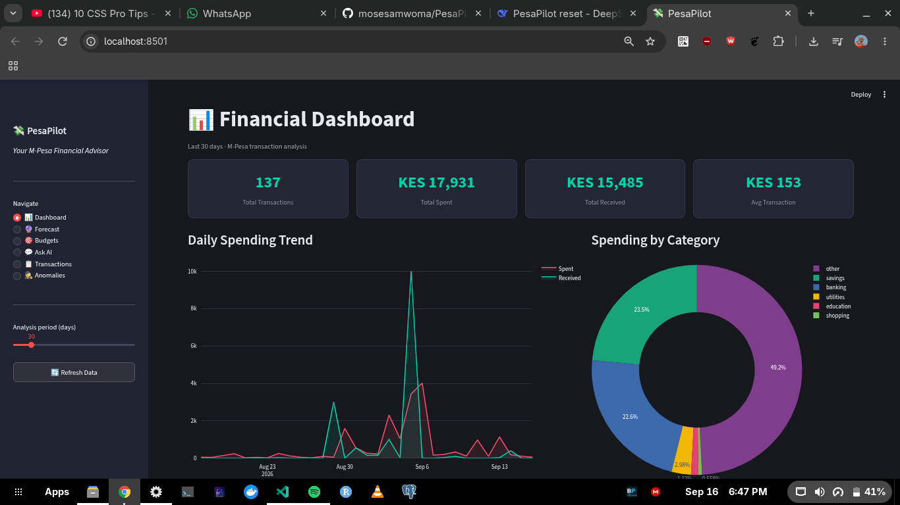
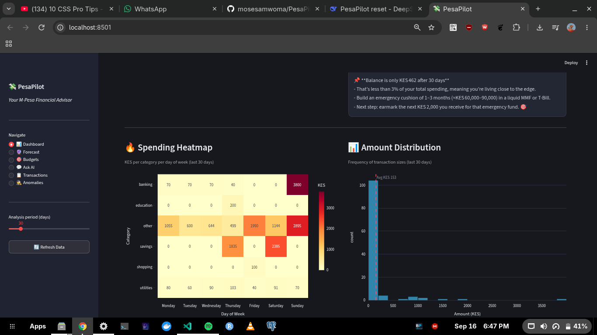
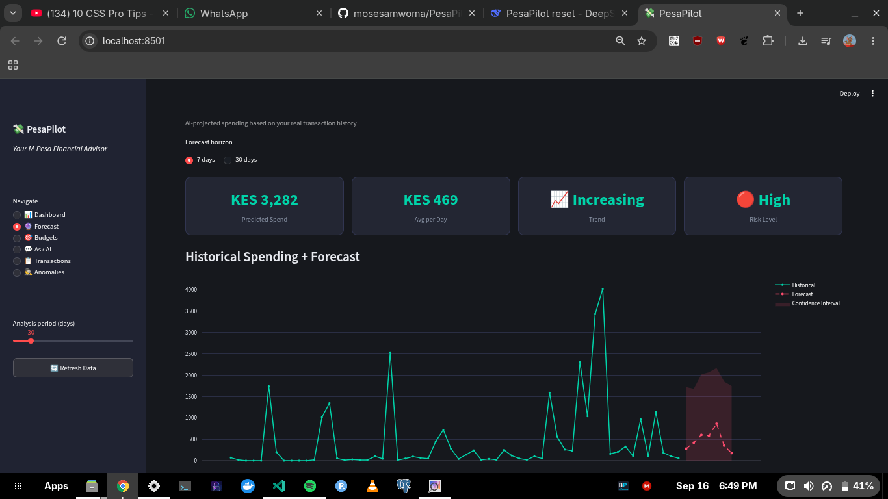
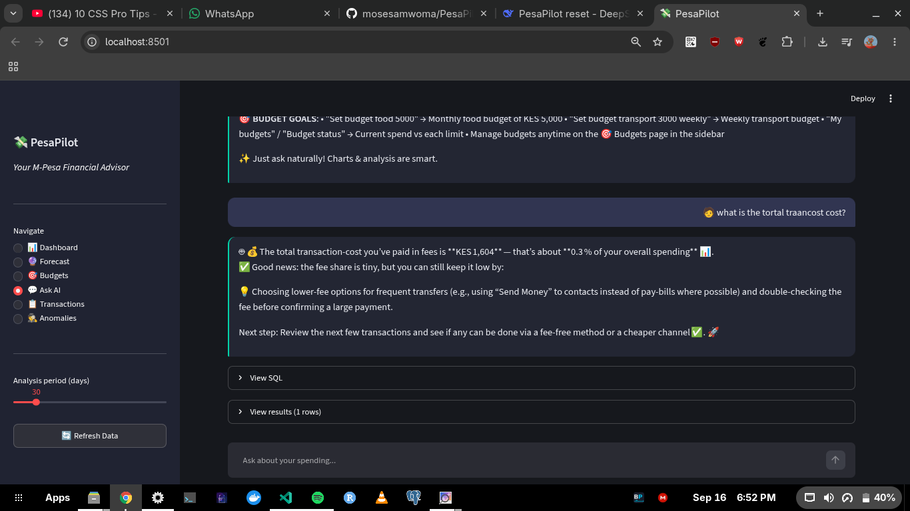

# PesaPilot

AI-powered M-Pesa financial assistant for Kenya. Parses your SMS transaction backup into a self-hosted PostgreSQL database, then lets you explore spending and get Kenyan financial advice via a Streamlit dashboard or WhatsApp.


---

## Features

- **Dashboard** — spending overview, daily trend, category breakdown, top merchants, heatmap, histogram, AI insights

  
  

- **Forecast** — Prophet-powered 7/30-day spending projection with trend, risk level, and a Groq summary
- **Ask AI** — plain-English questions turned into SQL by Groq, answered from your real numbers
- **Budget plans** — a KES needs/wants/savings split sized to your spending
- **Investment guidance** — Sacco / MMF / T-Bill suggestions sized to your free cash flow
- **Transactions** — filterable, searchable history
- **Transaction cost tracking** — M-Pesa fees parsed and stored separately from amount; visible by category and as % of spend
- **Natural-language charts** — describe a chart in plain English; an LLM resolves type, date range, grouping, and metric
- **Smarter anomaly detection** — per-user ML pattern learning, not a fixed z-score
- **Budget goals with alerts** — proactive WhatsApp pings near/over budget
- **WhatsApp Bot** — same questions, charts, advice, and manual SMS logging, from WhatsApp
- **Daily summary** — 9 PM (Africa/Nairobi) end-of-day digest
- **Two-tier AI** — fast model for chat/insights, smarter model for SQL/analysis/advice
- **SQL safety guard** — every LLM-generated query is validated `SELECT`/`WITH`-only and runs in a read-only transaction with a 10 s timeout
- **Response caching** — in-memory TTL cache on all Groq calls, cleared on new transactions

> Loading SMS data has no CLI/dashboard button — see [Parse and load your data](#5-parse-and-load-your-data).

---

## WhatsApp Bot — Two Modes

Both share the same FastAPI backend and Postgres database — only the WhatsApp connection differs.

| | `whatsapp_bot.js` | `whatsapp_bot.ts` |
|---|---|---|
| Library | whatsapp-web.js | Baileys |
| Connection | Headless Chrome (Puppeteer) | Pure WebSocket |
| Use case | Local dev | Docker / VPS (production) |
| Memory | ~300–500 MB | ~80–120 MB |
| Auth session | `.wwebjs_auth/` | `.baileys_auth/` |
| npm script | `npm run dev:wwebjs` | `npm run dev` |
| Docker | not used | default |

Use `.js` for local development, `.ts` (Baileys) for anything deployed — it's light enough to run on a Raspberry Pi 3B+.

---

## Prerequisites

- Python 3.10+
- Node.js 20+
- Self-hosted PostgreSQL (local or VPS)
- A [Groq](https://console.groq.com) API key (free tier works)
- Docker + Docker Compose for production
- A spare WhatsApp-capable SIM

---

## 1. Clone and install

```bash
git clone https://github.com/mosesamwoma/PesaPilot.git
cd PesaPilot

python -m venv venv
source venv/bin/activate
pip install -r requirements.txt

npm install
```

---

## 2. Configure environment variables

```bash
cp .env.example .env
```

Fill in `.env` — never commit it (already in `.gitignore`).

### Required

| Variable | Notes |
|---|---|
| `POSTGRES_USER` / `POSTGRES_PASSWORD` / `POSTGRES_DB` | Same names the official Postgres Docker image uses |
| `GROQ_API_KEY` | console.groq.com → API Keys |
| `WHATSAPP_MAIN_NUMBER` | e.g. `254712345678` — the number you text the bot **from** |
| `WHATSAPP_PIN` | Any 4-digit code, used for manual SMS entry |

`POSTGRES_HOST=auto` (default) lets one `.env` work everywhere — bare metal (`127.0.0.1`), Docker (`host.docker.internal`, falling back to `172.17.0.1`), Podman (`host.containers.internal`). Set it explicitly to skip detection, e.g. for a remote Postgres server. Passwords with special characters are safe as-is — no URL-encoding needed.

### Optional (defaults shown)

| Variable | Default | Purpose |
|---|---|---|
| `API_URL` | `http://127.0.0.1:8000` | Where the bot finds the FastAPI service |
| `WHATSAPP_API_PORT` | `8000` | FastAPI port |
| `WHATSAPP_LID` | empty | WhatsApp's internal ID for your number. Both bots resolve it automatically, so leave it empty. Set it only if the bot ignores your messages: the log prints the sender next to `From:` — copy that number here and restart |
| `LLM_MODEL_FAST` | `openai/gpt-oss-20b` | Chat / dashboard insights |
| `LLM_MODEL_SMART` | `openai/gpt-oss-120b` | SQL generation, analysis, advice |
| `LLM_TEMPERATURE` | `0.6` | Groq sampling temperature |
| `LLM_MAX_TOKENS` | `1536` | Max tokens per response |
| `TZ` | `Africa/Nairobi` | Log timestamps, daily-summary cron |
| `WHATSAPP_USE_PAIRING_CODE` | `false` | Pairing code instead of QR (Baileys) |
| `BAILEYS_AUTH_PATH` | `./.baileys_auth` | Baileys session storage |
| `WWEBJS_AUTH_PATH` | `./.wwebjs_auth` | whatsapp-web.js session storage |
| `LLM_REASONING_EFFORT` | `low` | `low` / `medium` / `high` |
| `API_TIMEOUT` | `20` | Seconds before a Groq call is aborted |
| `API_BIND` | `127.0.0.1` | Docker only: host interface the API port is published on. The API has no authentication — only use `0.0.0.0` behind a firewall/reverse proxy |
| `API_BIND_HOST` | `127.0.0.1` | Interface the API process binds to outside a container (the compose files set `0.0.0.0` inside the container) |
| `CORS_ORIGINS` | empty (CORS off) | Comma-separated full origins allowed to call the API from a browser, e.g. `https://app.example.com,http://[2001:db8::1]:8501`. The bot and dashboard do not need it |
| `BAILEYS_LOG_LEVEL` | `info` | Baileys/pino log level |
| `WHATSAPP_QR_LINK` | `true` | Both bots also print a fallback link (rendered by the third-party api.qrserver.com) for the login QR, for terminals that cannot draw it. The QR is a device-linking secret, so set `false` to turn the link off |

---

## 3. Create the database schema

```bash
sudo -u postgres psql
CREATE USER pesapilot_user WITH PASSWORD 'StrongPassword123!';
CREATE DATABASE pesapilot OWNER pesapilot_user;
\q
```

```bash
PGPASSWORD="StrongPassword123!" psql -h 127.0.0.1 -p 5432 -U pesapilot_user -d pesapilot -f schema/init_db.sql
```

> Postgres never runs inside Docker here — `docker-compose.yml` only runs the app. Always run `psql` from a machine with network access to your Postgres server.

`schema/init_db.sql` is idempotent — re-running it on an existing database is safe and picks up schema fixes. All SQL functions and views compute dates in `Africa/Nairobi` time regardless of the database server's timezone. The old `run_query` function and the unused `daily_summary` / `category_summary` views were removed; drop them from an existing database with `DROP FUNCTION IF EXISTS run_query(TEXT); DROP VIEW IF EXISTS daily_summary, category_summary;`.

Already have a `transactions` table without `transaction_cost`? Run this additive migration instead:

```bash
PGPASSWORD="$POSTGRES_PASSWORD" psql -h 127.0.0.1 -p "$POSTGRES_PORT" -U "$POSTGRES_USER" -d "$POSTGRES_DB" -c "ALTER TABLE transactions ADD COLUMN IF NOT EXISTS transaction_cost DECIMAL(12,2) NOT NULL DEFAULT 0;"
```

Existing rows backfill to `0` — re-import your SMS backup afterward to get real fee amounts.

---

## 4. Get your M-Pesa data

1. Install [SMS Backup & Restore](https://play.google.com/store/apps/details?id=com.riteshsahu.SMSBackupRestore)
2. **Back Up** → **SMS only** → save to storage or Drive
3. Transfer the XML to your computer, place it in `data/raw/`

---

## 5. Parse and load your data

```bash
python -c "from src.analyzer import MpesaAnalyzer; count = MpesaAnalyzer().load_transactions('data/raw/your-sms-backup.xml', 'data/processed/mpesa_transactions.csv'); print(f'Loaded {count} transactions')"
```

Saves a cleaned CSV to `data/processed/` and upserts into Postgres — safe to re-run (upserted by `transaction_id`).

**What gets imported (and what doesn't):**

| Message | Result |
|---|---|
| Inbox SMS from sender `MPESA` starting with a 10-character transaction code and `Confirmed` | Imported — codes made only of letters are valid and are kept. Messages you sent, and messages from banks, Safaricom promos or other senders, are ignored |
| `Give KshX cash to <agent>` | Cash **deposit** → `credit` / `banking` |
| `Withdraw KshX from <agent>` | `withdrawal` / `banking` |
| `You bought KshX of airtime` | `airtime` / `utilities`, recipient `Airtime` |
| Reversals | `credited to your M-PESA` → `credit`; `debited from` → `debit`; recipient `M-Pesa Reversal` |
| Balance enquiries, cancelled/failed/invalid-PIN/insufficient-funds notices, declined reversals | Skipped — not money movement |
| Fuliza drawdown notices and Fuliza repayments | Skipped — the purchase itself is already recorded, so counting the loan or its repayment would double-count spending |

Timestamps are stored in Nairobi local time (the SMS receipt time, or the time printed in the message when delivery was delayed by more than 10 minutes). `merchant_category` is decided from the recipient/account name only — never from the promotional footer of the SMS — and money sent to or received from a phone number is categorised `personal`.

**Upgrading an existing database:** re-run the import above so previously stored rows are corrected (timestamps, deposits, categories, recipients), then remove rows from messages that are no longer imported:

```sql
DELETE FROM transactions
WHERE body ILIKE '%Fuliza M-PESA amount is%'
   OR body ILIKE '%used to % pay your outstanding Fuliza%';
```

---

## 6. Run locally

**Dashboard:**
```bash
streamlit run dashboard/app.py
```
Open [http://localhost:8501](http://localhost:8501).

**API + WhatsApp bot (whatsapp-web.js, local dev):**
```bash
npm run api          # Terminal 1
npm run dev:wwebjs    # Terminal 2
```
Scan the QR: WhatsApp → Settings → Linked Devices. Session persists in `.wwebjs_auth/`.

**API + WhatsApp bot (Baileys, also works locally):**
```bash
npm run api   # Terminal 1
npm run dev   # Terminal 2
```
Session persists in `.baileys_auth/`.

> The Streamlit dashboard is local-only and not included in the Docker image.

---

## npm scripts

```bash
npm run api          # FastAPI on 127.0.0.1:8000
npm run dev           # Baileys bot via ts-node, auto-restart
npm run dev:wwebjs    # whatsapp-web.js bot via nodemon
npm run build         # Compile whatsapp_bot.ts -> dist/
npm start             # Run compiled Baileys bot
npm run start:wwebjs  # Run whatsapp-web.js bot
npm run clean         # Remove dist/ and auth folders
```

---

## CLI reference

There is no CLI wrapper. Start the API with `npm run api` and the dashboard with `streamlit run dashboard/app.py`. For a database connection check: `python -c "from src.database import PostgresDB; PostgresDB()"`.

---

## The Forecast page

Uses [Meta Prophet](https://facebook.github.io/prophet/) to project spending 7 or 30 days out. Needs at least 14 days of history.



1. Pulls up to 180 days of debit transactions
2. Aggregates into a zero-filled daily series
3. Prophet fits a linear-growth model with weekly seasonality
4. Cached 6 hours, invalidated on new inserts
5. Groq writes a plain-English summary, framed as a prediction

**Trend:** Increasing/Decreasing/Stable, by ±7% change between forecast halves.
**Risk:** High (>25% above pace or volatility >0.9) / Moderate (10–25% or 0.6–0.9) / Low otherwise.

---

## What you can ask the bot



| You send | What happens |
|---|---|
| `pie chart of my spending by category last month` etc. | Chart image, any type + date range, in your own words |
| `how much has M-Pesa charged me in fees this month?` | Fee breakdown, separate from spending |
| `What did I spend on food?` | Plain-English KES + % answer |
| `Give me a budget plan` | Needs/wants/savings split, one category to trim |
| `What should I invest in?` | Sacco / MMF / T-Bill suggestion |
| `forecast` / `forecast 30 days` | Forecast with trend, risk, AI summary |
| `Summary` / `Daily summary` / `Today` | Period or daily digest |
| `help` | Full command list |
| `1234-MJ7XK2P9 Confirmed...` | Manual SMS: `PIN-PASTE_SMS_HERE` |

Anyone texting the number who isn't `WHATSAPP_MAIN_NUMBER`/`WHATSAPP_LID` is left alone — no auto-reply, so you can answer manually.

---

## Docker (VPS / Production)

Uses Baileys (`whatsapp_bot.ts`) only — pure WebSocket, no Chromium, ~80 MB footprint. `whatsapp_bot.js` is for local dev and never runs in the container. One container runs both FastAPI and the bot.

```bash
docker compose up -d --build
docker compose logs -f pesapilot
```

Health check (run on the VPS — the API is bound to `127.0.0.1` by default): `curl http://127.0.0.1:8000/health`

**Persisted (bind mounts):**

| Host path | Container path | Purpose |
|---|---|---|
| `./sessions` | `/app/.baileys_auth` | Baileys session |
| `./data` | `/app/data` | Transaction files |

```bash
tar czf pesapilot-backup-$(date +%F).tar.gz ./sessions ./data
```

**Management:**
```bash
docker compose ps
docker compose logs -f pesapilot
docker compose restart pesapilot
docker compose down
docker compose up -d --build

# Force a new QR scan
docker compose exec pesapilot rm -rf /app/.baileys_auth
docker compose restart pesapilot
```

**Test the API** (run these on the VPS, or via `ssh -L 8000:127.0.0.1:8000 user@YOUR_VPS_IP` from your laptop):
```bash
curl http://127.0.0.1:8000/health

curl -X POST http://127.0.0.1:8000/ask \
  -H "Content-Type: application/json" \
  -d '{"question": "What did I spend on food?"}'
```

---

## Redeploying after a code change

`redeploy.sh` syncs local changes to your VPS and rebuilds/restarts the container. No hardcoded server details — you're prompted each run.

```bash
chmod +x redeploy.sh
./redeploy.sh
```

You'll be asked for VPS username, host/IP, and the project path relative to the remote home (default `PesaPilot`), then your SSH password. It rsyncs the project (skipping `node_modules`, `venv`, `dist`, `.git`, sessions, auth, logs), rebuilds via `docker compose up -d --build`, then shows container status.

```bash
./redeploy.sh --no-build   # sync + restart, no rebuild
./redeploy.sh --logs       # tail logs after deploying
```

---

## How the AI advice is grounded

Every Groq question is paired with live context from Postgres: summary stats, top categories, top merchants, recent daily trend, detected anomalies. A Kenya-specific system prompt (`src/groq_client.py`) enforces amounts + percentages, comparisons to averages, one actionable tip, real Kenyan options (Sacco/MMF/T-Bills), a budget split, an emergency-fund nudge — never Fuliza or a named bank.

| Model | Used for |
|---|---|
| `LLM_MODEL_FAST` | `chat()`, `generate_insights()`, `generate_forecast_insights()` |
| `LLM_MODEL_SMART` | `generate_sql()`, `analyze_results()`, `budget_plan()`, `investment_advice()` |

**SQL safety guard** (`src/sql_guard.py`): every LLM query passes `is_safe_select_sql()` — must start with `SELECT` or `WITH`, no `;`, no comments, none of `DROP/DELETE/UPDATE/INSERT/ALTER/TRUNCATE/GRANT/REVOKE/EXEC/EXECUTE/CREATE/ATTACH/MERGE/CALL/COPY`, no `pg_*`/`lo_*`/`dblink`/`set_config` functions. It then runs in a read-only transaction with a 10 s statement timeout, capped at 500 rows. User *questions* are only rejected when they contain actual destructive statements (e.g. `drop table …`), so ordinary questions like "how much did I spend on call credit?" work.

**Caching:** every Groq call is cached in-memory by a hash of (system, user) prompt, TTL from 5 min (chat) to 1 hour (SQL), cleared on new transactions.

---

## Testing

```bash
pip install -r requirements-dev.txt
pytest
```

Two test files, one for each outside service:

| File | Covers | Needs |
|---|---|---|
| `tests/test_real_data_db.py` | Your real SMS export parsed and loaded into PostgreSQL: row counts, summaries, category totals, the read-only query guard, every SQL analytics function, Nairobi timestamps, the anomaly join | An SMS XML in `data/raw/` (or `PESAPILOT_SMS_XML=/path/to/export.xml`) and a disposable database whose name contains `test` (`POSTGRES_DB=pesapilot_test`, schema applied) |
| `tests/test_groq.py` | The Groq client with a fake API: SQL cleanup and rejection of unsafe SQL, response caching, error handling, model routing, budget alert fallback | Nothing (no key, no network) |

```bash
POSTGRES_USER=pesapilot POSTGRES_PASSWORD=... POSTGRES_DB=pesapilot_test POSTGRES_HOST=127.0.0.1 \
PESAPILOT_SMS_XML=data/raw/your-sms-backup.xml pytest
```

`test_real_data_db.py` skips itself when either input is missing. `tests/conftest.py` only provides the shared fixtures. Your raw SMS export is never committed — `data/raw/*` is git-ignored.

---

## Troubleshooting

| Issue | Fix |
|---|---|
| `.env file not found!` | Copy `.env.example` to `.env` first |
| `relation ... does not exist` / missing function errors | Apply `schema/init_db.sql` |
| `ModuleNotFoundError: No module named 'src'` | Run from the project root |
| No transactions after loading XML | Confirm it's an SMS Backup & Restore export with M-Pesa messages |
| Port 8000 in use | Change `WHATSAPP_API_PORT`, update `API_URL` and `docker-compose.yml` |
| Baileys `405` loop, no QR | Wipe `.baileys_auth/` and restart |
| Baileys QR never appears | Check container internet: `docker compose exec pesapilot curl -I https://web.whatsapp.com` |
| wwebjs `Failed to launch browser` | Chrome missing or wrong `PUPPETEER_EXECUTABLE_PATH` (local dev only) |
| wwebjs `profile already in use` | Delete `.wwebjs_auth/`, restart, rescan |
| Podman permission denied on volumes | Confirm `:Z` suffix in `podman/compose.yml` |
| Session keeps logging out | Confirm auth path isn't wiped by your deploy process |
| Charts not sending | `pip install matplotlib seaborn` |
| Forecast "not enough data" | Needs 14+ distinct days of debits |
| Forecast "engine unavailable" | `pip install prophet cmdstanpy` |
| Groq rate limit / empty responses | Wait ~60s; lower `LLM_MAX_TOKENS` |
| `streamlit: command not found` | `source venv/bin/activate` |
| Dates look 3 hours off after upgrading | Re-run the import (step 5) — old rows were stored in UTC |
| `balance` empty for some rows | Not every SMS includes it; the parser now imports only M-Pesa transaction messages, which all do |
| Bot ignores your messages | The `From:` line in the bot log shows the ID WhatsApp used. If it is not your phone number, copy it into `WHATSAPP_LID` and restart |
| Can't connect to Postgres | Check detected host in startup logs; avoid `localhost` (use `127.0.0.1` or real IP) |
| `time data ... doesn't match format` | Ensure timestamp parsing uses `format='ISO8601'` everywhere |

---

## Future Improvements

- Multi-user support (currently one number/database)
- Other providers — Airtel Money, T-Kash
- Self-hosted/local LLM option
- CI/CD via GitHub Actions
- Native mobile app